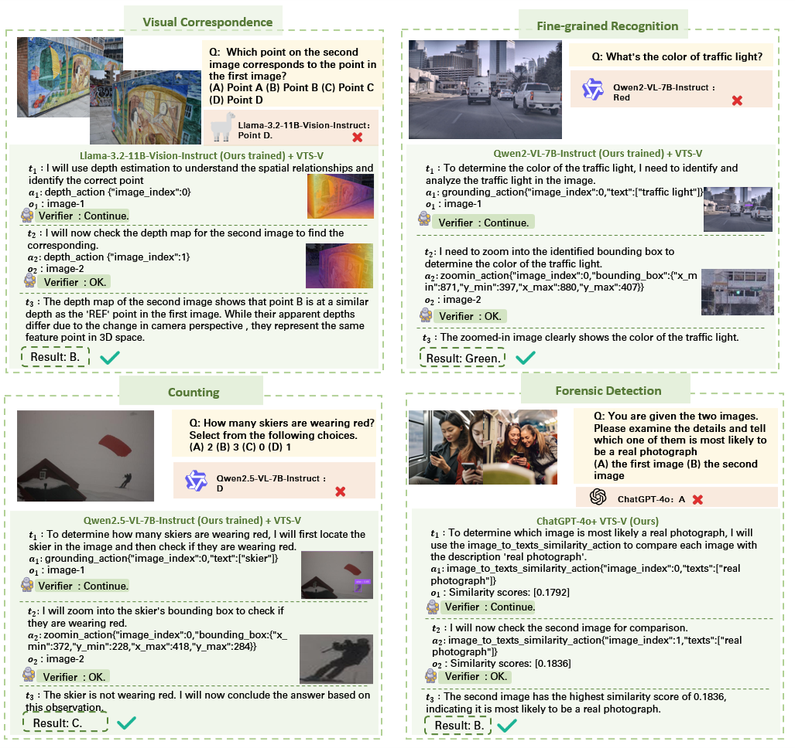

# VTS-V: Multi-step Visual Reasoning with Visual Tokens Scaling and Verification

This repository is the official implementation of [Multi-step Visual Reasoning with Visual Tokens Scaling and Verification]

# Introduction



# Requirements

To install requirements:

```bash
conda create -n vts_v python=3.10
conda activate vts_v
pip install -r requirements.txt
```


# Quick Start

## Step-1: Launch model deployment

You can use closed-source APIs and open-source models to run our method VTS-V.

### Closed-source APIs
For closed-source APIs, the system must support OpenAI's chat/completions functionality. 

In our experiments, we used **GPT-4o** to perform reasoning tasks.

If you intend to use GPT-4o as the reasoning model, you need to set the base URL and API key in the test script to your own values.

```bash
## Set OpenAI API base-url and api-key here
export OPENAI_BASE_URL=https://api.openai.com/v1 # default value
export OPENAI_API_KEY=your-openai-api-key-here
```


### Open-source Models

For open-source models, they need to be deployed in OpenAI API format using vLLM or SGLang.

In our approach, we employed the [Qwen2.5VL-7B-Instruct](https://huggingface.co/Qwen/Qwen2.5-VL-7B-Instruct), [Qwen2VL-7B-Instruct](https://huggingface.co/Qwen/Qwen2-VL-7B-Instruct), and [LLaMA-3.2-11B-Vision-Instruct](https://huggingface.co/meta-llama/Llama-3.2-11B-Vision-Instruct) models, along with our corresponding fine-tuned versions. For the Qwen2.5VL and Qwen2-VL series models, we utilized vLLM for deployment, while for the LLaMA-3.2-Vision series models, we adopted SGLang for deployment.

For vLLM, you can see [qwen2vl_28080.sh](./client/vllm/qwen2vl_28080.sh) and [qwen25vl_28080.sh](./client/vllm/qwen25vl_28080.sh) as examples.

For SGLang, you can see [llama32vision.sh](./client/sglang/llama32vision_28080.sh) as an example.


In the [qwen2vl_28080.sh](./client/vllm/qwen2vl_28080.sh), [qwen25vl_28080.sh](./client/vllm/qwen25vl_28080.sh) and [llama32vision.sh](./client/sglang/llama32vision_28080.sh) scripts, you need to specify `MODEL_PATH` with your own model path or the corresponding HuggingFace model ID, and specify `MODEL_PORT` with your chosen port number. Note that these `MODEL_PATH` and `MODEL_PORT` values must remain consistent with what you set here when running subsequent test scripts.

```bash
# set your own model path
MODEL_PATH=your_model_path_or_name_here
# set your own port
MODEL_PORT=28080
```

## Step-2: Using VTS-V Inference and Evaluation

**Supported Benchmark:** Currently, our supported benchmarks for testing include [BLINK](https://huggingface.co/datasets/BLINK-Benchmark/BLINK), [MathVista](https://huggingface.co/datasets/AI4Math/MathVista), [MMStar](https://huggingface.co/datasets/Lin-Chen/MMStar), and [Vstar](https://huggingface.co/datasets/craigwu/vstar_bench).


**Evaluation Scripts:** You can find the scripts to run our method in the [`eval/BLINK/scripts`](./eval/BLINK/scripts/), [`eval/MathVista/scripts`](./eval/MathVista/scripts/), [`eval/MMStar/scripts`](./eval/MMStar/scripts/), [`eval/Vstar/scripts`](./eval/Vstar/scripts/) folders.

**Method Modes:** Our method operates in three modes: **Direct**, **VTS**, and **VTS-V**.
- **Direct** refers to directly using the reasoning model to test the benchmark.
- **VTS** refers to employing Multi-step Visual Reasoning with Visual Tokens Scaling but without the Verifier.
- **VTS-V** refers to using the complete Multi-step Visual Reasoning with Visual Tokens Scaling and Verification.

In these scripts, different operation modes can be configured by setting corresponding command-line arguments. The specific modes and parameter settings are detailed in the following table:
| Mode | using_vts | using_verifier | 
|------| --------- |----------------| 
|Direct| False     |   False        | 
|VTS   | True      |   False        |
|VTS-V | True      |   True         |


**LLM-as-a-judge:** When evaluating the benchmark, for cases where the correctness of responses cannot be directly determined programmatically, we employ the LLM-as-a-judge approach. By default, we use `Qwen-max` as the LLM-as-a-judge evaluation model. You need to specify your own Qwen-Max's base URL, API key, and model name in the script through the following variables:
```bash
# default 
export DASHSCOPE_BASE_URL="https://dashscope.aliyuncs.com/compatible-mode/v1"
export DASHSCOPE_API_KEY=your-dashscope-api-key-here
export DASHSCOPE_MODEL="qwen-max"
```
Alternatively, you can use any other API that supports the OpenAI chat completion format. You may configure your own API base URL, API key, and model name, but please do not modify these variable names as it may cause errors. For example, if you wish to use GPT-3.5-turbo as the evaluation model, you can set the following parameters:
```bash
export DASHSCOPE_BASE_URL=your-base-url-here
export DASHSCOPE_API_KEY=your-api-key-here
export DASHSCOPE_MODEL="gpt-3.5-turbo"
```


#### Step2-1: Direct 


#### Step2-2: Using VTS Inference


| Mode | using_vts | using_verifier | reasoner_model| dpo_model_path | ref_model_path|
|------| --------- |----------------| --------------|----------------| ---------------|
|Direct| False     |   False        | None          | None           | None           |
|VTS   | True      | False          |

#### Step2-3: Using VTS-V inference


## Data Construction


## Training


## Contributing
