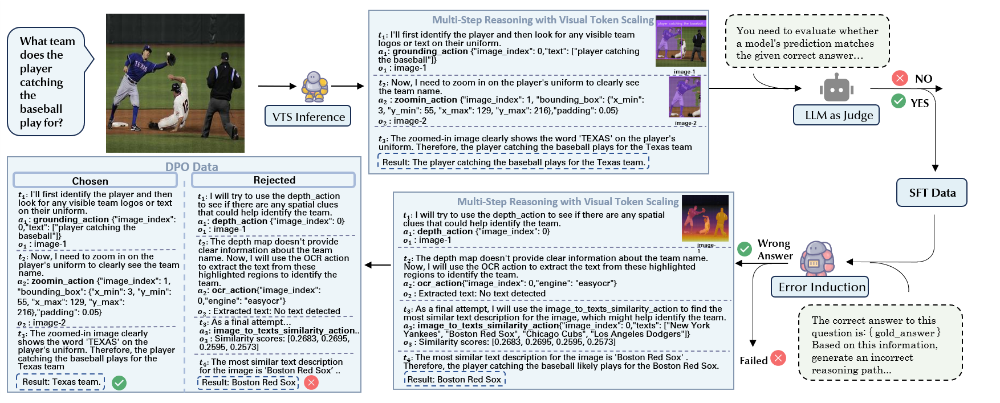

# Dataset Construction

In our work, we constructed a 315K SFT dataset and a 301K DPO dataset by sampling from [LLaVa-OneVision-Data](https://huggingface.co/datasets/lmms-lab/LLaVA-OneVision-Data).

We conduct SFT training using [LLaMA-Factory](https://github.com/hiyouga/LLaMA-Factory), thus our final SFT dataset follows LLaMA-Factory's required format:
```json
[
    {
        "images" :[],
        "messages" : [],
    },
    ...
]
```

We conduct SFT training using the [TRL](https://huggingface.co/docs/trl/index) library, thus our final DPO dataset follows TRL's supported format:
```json
[
    {
        "prompt": [],
        "chosen": [],
        "rejected": [],
        "image_path": str,
        "source": str,
        "id": str,
    },
    ...
]
```


# Introduction



# Data Construction Pipeline

Our data construction pipeline consists of three key stages:
- VTS Inference Phase (vts_inference)
- SFT Data Generation (sft_data_gen)
- DPO Data Generation (dpo_data_gen)

## Step 1: VTS Inference

We employ [Qwen2.5-VL-72B-Instruct](https://huggingface.co/Qwen/Qwen2.5-VL-72B-Instruct) as the reasoning model to execute the VTS (Visual Token Scaling) mode in our methodology.

First, we employ data sharding to enable parallel data generation across multiple GPUs. The execution script is [1_vts_inference.sh](./vts_inference/scripts/1_vts_inference.sh)

You need to specify your own model path for Qwen2.5-VL-72B-Instruct and the port used in the script:
```bash
QWEN_PATH=your_model_path_here
QWEN_PORT=28080
```
And also you should set TASK_NAME to either a specific subset name from LLaVA-OneVision-Data or "all" to execute all subsets
```bash
TASK_NAME="figureqa(cauldron,llava_format)"
```

Then run the following command in the terminal:
```bash
conda activate vts_v
cd datagen/vts_inference/scripts
bash 1_vts_inference.sh
```

Secondly, we need to merge and deduplicate the generated data. You can execute the script [merge_trace.sh](./vts_inference/scripts/2_merge_trace.sh):
```bash
bash 2_merge_trace.sh
```

## Step 2-1: SFT Dataset Generation

Building upon the data generated in [Step 1: VTS Inference](#step-1-vts-inference), we employ the LLM-as-a-judge approach to evaluate the correctness of reasoning results, utilizing the Qwen2.5-VL-72B-Instruct model as our evaluation model.


Firstly, you can execute the script [1_sft_datagen.sh](./sft_data_gen/scripts/1_sft_datagen.sh) to perform SFT data synthesis and format conversion.

You need to configure your own model path and port in the script:
```bash
MODEL_PATH=your_model_path_here
MODEL_PORT=28080
```

Then run the following command in the terminal:
> Note: We execute the process on 4×A800 GPUs with 80GB memory each.
```bash
conda activate vts_v
cd datagen/sft_data_gen/scripts
bash 1_sft_datagen.sh
```

Secondly, you need to perform data filtering:
```bash
conda activate vts_v
cd datagen/sft_data_gen/scripts
bash 2_data_filter.sh
```

## Step 2-2: DPO Dataset Generation

We need to perform DPO data synthesis based on the data generated in [Step 1: VTS Inference](#step-1-vts-inference).

Firstly, we need to generate dispreference data:

You need to configure your own model path and port in the script:
```bash
MODEL_PATH=your_model_path_here
MODEL_PORT=28080
```

Then run the following command in the terminal:
> Note: We execute the process on 4×A800 GPUs with 80GB memory each.
```bash
conda activate vts_v
cd datagen/dpo_data_gen/scripts
bash 1_dpo_datagen.sh
```

Secondly, perform DPO data format conversion:
```bash
bash 2_dpo_format_gen.sh
```

Finally, we filter the data based on token counts using Qwen2.5-VL-7B-Instruct's tokenizer. We remove samples where:`tokens(prompt) + max(tokens(chosen), tokens(rejected)) > 10,000`. The purpose of this step is to prevent Out-of-Memory (OOM) errors during training caused by excessively long data samples.
```bash
bash 3_data_filter_by_tokens.sh
```